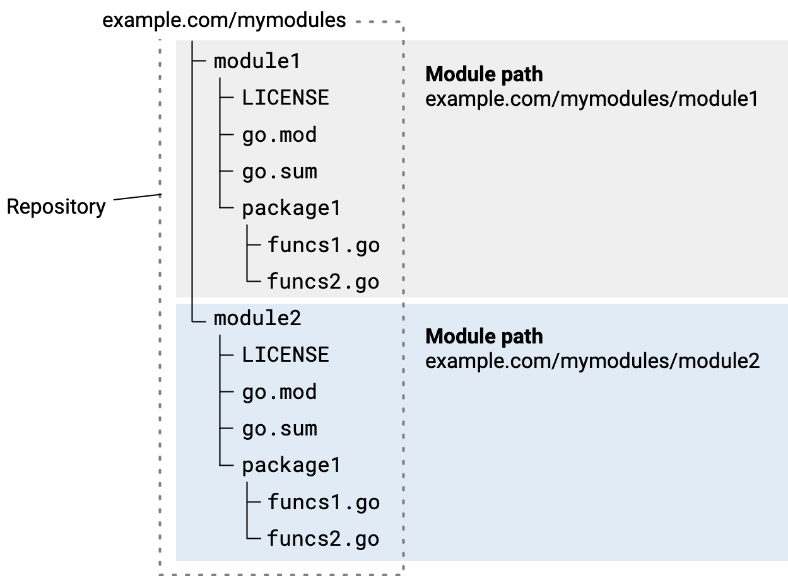

# The Go Programming Language

This note is a work in progress documenting my process of learning the [Go programming language](https://go.dev/). Its purpose is merely to document, and as such, it is likely to include errors, which I hope will get corrected over time. Follow at your own discretion.

## Go concepts - WIP

In this section, I document concepts related to the language that I have learned through one of the projects listed in the further sections.

### Creating a Go project - WIP

First, we initialize a new [Go module](https://go.dev/blog/using-go-modules) by running the `go mod init` command.

The nomenclature is different than in Python, as a Go module is a collection of packages, which hold `.go` files. Here, we can understand modules are being segregated projects, which can use multiple packages. As per the [standard project layout](https://github.com/golang-standards/project-layout), the app itself is located in a package called `cmd/` . I will look more into this as I build larger projects.



A `go` package has a path and a name. That is why some people put their github URL when running the command (see https://go.dev/blog/package-names#package-paths), i.e.

```console
go mod init github.com/maxime-filippini/gowiki
```

To automatically download/install packages that we refer to in our Go files, we can use the `go mod tidy` command. Otherwise, we use `go get` to download them manually.

Note: You cannot run go code if the `go.mod` file is not synced with the code file (i.e. missing a package, or any unnecessary package). `go mod tidy` takes care of that though.


### Data structures - WIP

#### Arrays and slices - WIP

Arrays are initialized in GO by the following.

```go
[2]int{}
```

This is an array of integers of size 2, initialized with no elements, which means the default `int` (i.e. 0) will populate it. We can also initialize them directly

```go
[2]int{1, 2}
```

To make a "dynamic array", we instead use **slices**, which are initialized with the `make` function, where we specify a length, and a **capacity**.

```go
s := make([]int, 0, 5)
```

This makes a slice of length 0 (i.e. empty), but with a capacity of 5. This means that, as long as the length of the array is less than 5, no additional memory allocation will be required to add elements to our array.

#### Structs - WIP

A structure in Go is written as a `type` , as the following.

```go
type verb struct {
	infinitive string
	presentTense string
	translations []string
}
```

struct fields can be "tagged" with metadata, to define how the value is to be encoded/decoded. For example, see the following example from the [colly documentation](https://go-colly.org/docs/examples/hackernews_comments/)

```go
type comment struct {
	Author  string `selector:"a.hnuser"`
	URL     string `selector:".age a[href]" attr:"href"`
	Comment string `selector:".comment"`
	Replies []*comment
	depth   int
}
```

These tags form key:"value" pairs, and in this case, are meant to inform a JsonEncoder, which will write each struct to a .json file.

#### Interfaces - TODO

TBD


## Projects

In this section, I detail various projects I have undertaken to try to gain an understanding of Go.

### Web crawler with a command-line interface (WIP)

#### Description

CLI tool that would crawl the https://en.wiktionary.org/ website to obtain definitions, conjugations and equivalents of words in the Croatian language. To be used during my learning of the language, to expand my vocabulary.

#### Objectives

- Learn about the structure of Go projects 
- Get familiar with Go's data structures
- Learn how to read and parse a webpage's html
- Learn the basics of CLIs in Go

#### Getting acquainted with `colly`

Colly is a web-scraping framework for Golang, which will we use to visit web-pages for our application.

Colly works by defining a `Collector` object, via

```go
c := colly.NewCollector()
```

We then define callback functions on this collector, which will trigger on event. For example, the following callback prints "Visiting" and the url of the request, when a request is being made.

```go
c.OnRequest(func(r *colly.Request) {
    fmt.Println("Visiting", r.URL)
})
```

For now, we want to scrape the html elements of a single page, we are mainly going to use the `OnHTML`  event, which is triggered when an HTML element is accessed. `colly`  uses [goquery](https://pkg.go.dev/github.com/PuerkitoBio/goquery) syntax to filter the elements being accessed.

#### The `flag` library

The previously-mentioned example uses the "flag" library, which is used to deal with command line flag arguments (see [documentation](https://pkg.go.dev/flag)).

#### Back to the example

the `OnHTML` is given the following selector `.comment-tree tr.athing"`. This means that the elements being retrieved are `<tr>` tags, with a class of `athing`, within elements with a class of `.comment-tree`.

Let us test this by setting up a similar callback for a Croatian word: "hoditi" (to walk). We start by getting all of the `<h3>` tags within the tag with a class of id `mw-content-text`.

```go
func main() {

	c := colly.NewCollector()
	
	c.OnHTML("#mw-content-text h3", func(e *colly.HTMLElement) {
		fmt.Println(e.Text)
	})
		
	c.Visit("https://en.wiktionary.org/wiki/hodati")
}
```

```console
$ go run .
Etymology[edit]
Pronunciation[edit]
Verb[edit]
```

Seems good so far!

Actually, looking up the `<h3>` tags will not be sustainable since some wiktionnary pages will have multiple languages listed, which will have a title stored in an `<h2>` tag, and which will all have a set of sub-titles in `<h3>` tags.

To be able to find a specific `<h2>` tag, and then limit ourselves to the DOM contents that follow but that precede the next `<h2>` tag, we will have to use Goquery.

#### Goquery

As per [this tutorial](https://benjamincongdon.me/blog/2018/03/01/Scraping-the-Web-in-Golang-with-Colly-and-Goquery/), `gocolly` does not allow us to move laterally through the HTML tree. For that, we use `goquery`.

Let's see how we can capture the contents of the HTML tree located **after** the serbo-croatian `<h2>` tag, using goquery.

We start by finding the tag on the page using a gocolly callback, i.e.

```go
c.OnHTML("h2 .mw-headline[id=Serbo-Croatian]", func(e *colly.HTMLElement){
	fmt.Println(e.Attr("id"))
})
```


See [this module](https://github.com/PuerkitoBio/goquery/blob/master/traversal.go) for the various goquery selectors.

To do what we want to do, we use the following. It does the following:

- Find the tag with id "Serbo-Croatian" within an `<h2>` tag.
- Go to the parent (i.e. the `<h2>` tag)
- Collect the sibling tags which come after that tag, only keeping the `<h3>` tags, which are the titles of the sub-sections.
- Stop at the next `<h2>` tag, which will correspond to another language.

```go
c.OnHTML("h2 .mw-headline[id=Serbo-Croatian]", func(e *colly.HTMLElement) {
	e.DOM.Parent().NextFilteredUntil("h3", "h2").Each(func(i int, s *goquery.Selection) {
		fmt.Printf("%s\n", s.Text())
	})
})
```

```console
Etymology[edit]
Pronunciation[edit]
Verb[edit]
```

As we can see, the Slovenian section of the page is not included because it is separated from the Croatian section by an `<h2>` tag.

#### Refactoring long callback functions

When the callback function grows large, we can factor it out by writing a closure, e.g.

```go
func getVerbItems(verbItems *[]verb) colly.HTMLCallback {
	return func(e *colly.HTMLElement) {
		// do stuff
		*verbItems = append(*verbItems, stuff)
	}
}

func main() {

	allVerbs := make([]verb, 0)
	verbItemCollector := colly.NewCollector(colly.AllowedDomains("en.wiktionary.org"))

	// do stuff...

	// We pass the address to getVerbItems, since it expects a pointer to the verb slice
	verbItemCollector.OnHTML("h2 .mw-headline[id=Serbo-Croatian]", getVerbItems(&allVerbs))

	// do more stuff...
}
```
